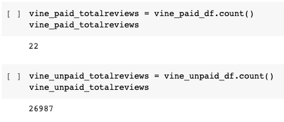
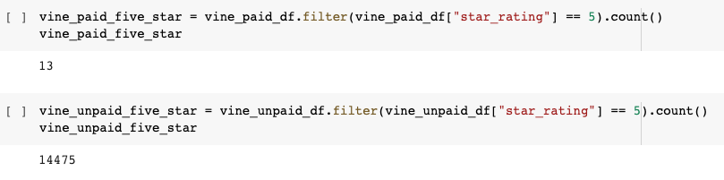
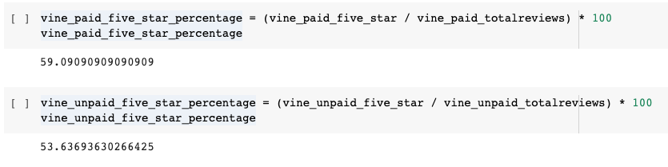

# Amazon Vine Analysis

## Overview
SellBy stakeholders requested an analysis of Amazon reviews written by members of the paid Amazon Vine program, to determine if there was any bias in the reviews. The Amazon Vine program is a service that allows manufacturers and publishers to receive reviews for their products. Companies like SellBy pay a small fee to Amazon and provide products to Amazon Vine members, who are then required to publish a review.

A Shoes category dataset was chosen to analyze, containing reviews of various shoes products. PySpark was used to perform the ETL process to extract the shoes dataset, transform the shoes data, connect to an AWS RDS instance, and load the transformed shoes data into pgAdmin. Next, PySpark was used to determine if there is any bias toward favorable reviews from Vine members in the shoes dataset.

This new assignment consisted of two technical analysis deliverables:
- Deliverable 1: Perform ETL on Amazon Product Reviews of shoes products
- Deliverable 2: Determine Bias of Vine Reviews of shoes products

## Results (Shoes products)
### Total reviews, both Vine and non-Vine
- Vine (paid): 22 
- Non-Vine (unpaid): 26,987

### 5-star reviews, both Vine and non-Vine
- Vine (paid): 13 
- Non-Vine (unpaid): 14,475

### Percentage 5-star reviews, both Vine and non-Vine
- Vine (paid): 59.1% 
- Non-Vine (unpaid): 53.6%

## Summary
An analysis of the Vine vs. non-Vine Shoes product reviews data appears to show a slight positivity bias towards Vine reviews, with about a 5.5% higher percentage of 5-star ratings in the Vine program (59.1% vs. 53.6%).

To verify whether this 5-star positivity bias was specific to Shoes products or more prevalent across the Vine program, it would be beneficial to run additional analysis on other products lines, since there are about 50 of them (IE, look at a broader data set).

